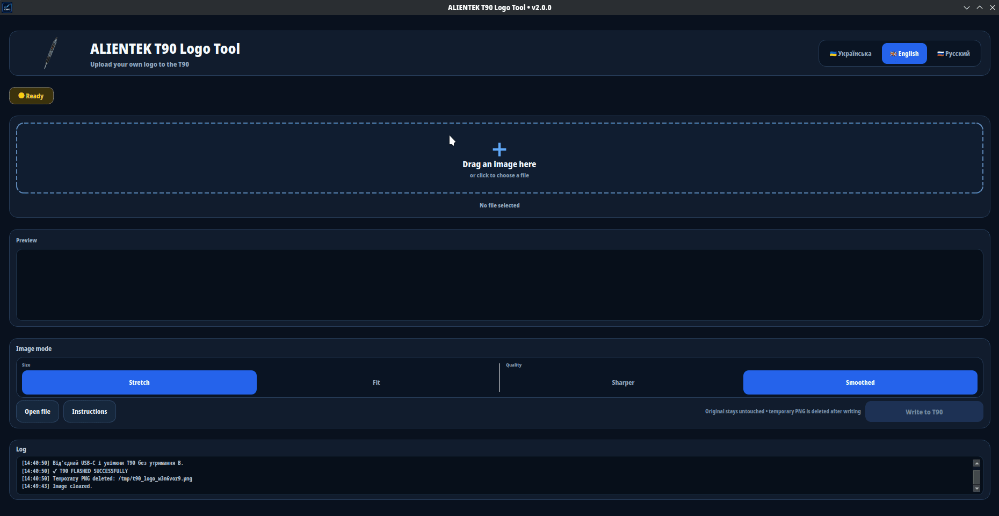

# ALIENTEK T90 Logo Tool

Modern open-source Linux GUI for preparing and flashing a custom **160×40 px** logo to the **ALIENTEK T90** soldering iron over USB HID.

<p align="center"></p>

<p align="center"><a href="https://github.com/Volod3/T90_tool/releases/latest"><strong>⬇ DOWNLOAD APPIMAGE</strong></a></p>><strong>⬇️ DOWNLOAD APPIMAGE</strong></a></p>

> Ready-to-run Linux AppImage — no Python, dependencies or terminal commands are required for normal users.

## ✨ Features

- 🖼 Drag & drop images
- 📐 Custom **160×40 px** logo
- ↔️ **Stretch / Fit** image modes
- 🔍 **Sharp / Smooth** scaling
- 🔲 Pixel-accurate **4× preview**
- 🔌 USB **HID flashing** directly to the T90
- 🌍 **Ukrainian, Russian and English** interface
- 📦 Ready-to-run **Linux AppImage**
- 🐍 Open-source Python codebase

## 🔧 Device

| Property | Value |
|---|---|
| Device | **ALIENTEK T90** |
| Logo size | `160×40 px` |
| USB VID:PID | `19F5:3245` |
| Transport | USB HID |
| Platform | Linux x86_64 |

## 📥 Installation

For normal users, the **AppImage** is the recommended way to run the application.

1. Download the latest AppImage using the **DOWNLOAD APPIMAGE** button above.
2. Open the AppImage file **Properties**.
3. Enable **Allow executing file as program**.
4. Double-click the AppImage to launch the application.

No Python installation, virtual environment or additional dependencies are required.

## 🛠️ Build from source

This section is intended for developers and contributors.

### Requirements

- Linux x86_64
- Python 3
- `python3-venv`
- `pip`
- PyInstaller
- Python HID support
- The already-tested `t90_flash.py` from the working T90 flashing project

### Clone

```bash
git clone https://github.com/Volod3/T90_tool.git
cd T90_tool
```

### Create the development environment

```bash
python3 -m venv .venv
.venv/bin/pip install -r requirements.txt
```

Then place the already-tested `t90_flash.py` in the repository root.

> **Important:** keep `t90_flash.py` unchanged. The flashing logic is based on the tested T90 project.

### Build the application

```bash
.venv/bin/pyinstaller   --noconfirm   --clean   --onefile   --windowed   --name Alientek-T90-Logo-Tool   --add-data "t90_flash.py:."   --add-data "assets:assets"   --hidden-import=hid   --collect-all hid   main.py
```

The resulting executable will be created in `dist/`.

## 🐧 AppImage

Official Linux AppImage builds are published through GitHub Releases.

The released AppImage is packaged for end users and does **not** require a Python environment or manual dependency installation.

## 🪟 Windows

GitHub Actions builds the Windows x64 executable on a hosted Windows runner.

A Windows PC is not required for the maintainer to produce the Windows build.

## 📁 Project structure

```text
T90_tool/
├── main.py
├── t90_flash.py
├── assets/
├── docs/
├── requirements.txt
└── dist/
```

## 🤝 Contributing

Contributions, bug reports and improvements are welcome.

When submitting changes:

1. Keep changes focused and easy to review.
2. Test the application locally.
3. Make sure the Python source compiles successfully.
4. Verify that T90 flashing still works.
5. Update the README when user-facing behavior changes.

## 📦 Releases

Official builds are published through GitHub Releases.

The latest release contains the ready-to-run Linux AppImage.

## 📄 License

MIT
